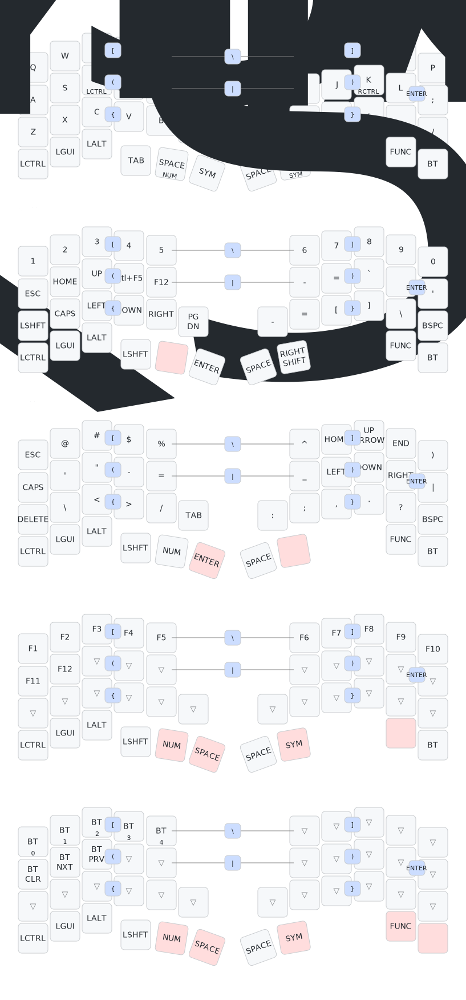

# Voltball ZMK Config

Voltball is an AA-powered 3x5 split ZMK keyboard using nice!nano v2 controllers. The right half includes a PAW3222 trackball.



Current assumptions:

- Split layout with 42 keys total
- Logical matrix is `4x12`
- Each half scans `4x6`
- Right half includes a PAW3222 trackball
- Battery is `AA` and uses `zmk-feature-non-lipo-battery-management`

Files of interest:

- `build.yaml`: build targets for `voltball_left` and `voltball_right`
- `boards/shields/voltball`: shield definition
- `config/voltball.keymap`: keymap with base, number, symbol, function, and Bluetooth layers
- `config/voltball.json`: keymap-drawer layout metadata
- `keymap_drawer.config.yaml`: keymap-drawer rendering config

Battery notes:

- Default ZMK `vbatt` is disabled in favor of `zmk,non-lipo-battery`
- `config/west.yml` includes `zmk-feature-non-lipo-battery-management`

Typical build examples:

```sh
west init -l config
west update
west zephyr-export
west build -s zmk/app -b nice_nano_v2 -- -DSHIELD=voltball_left
west build -s zmk/app -b nice_nano_v2 -- -DSHIELD=voltball_right
```
